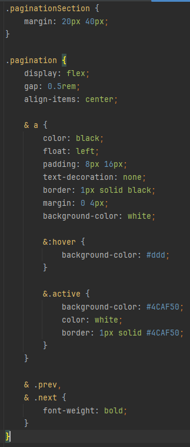
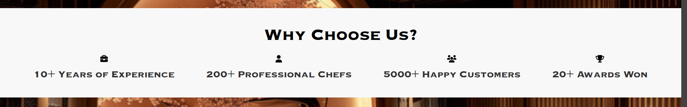
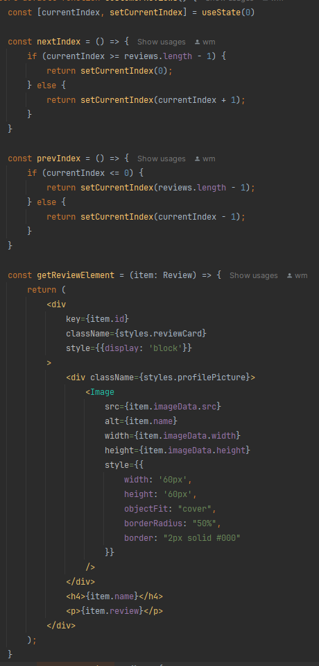

# Gray Paper

### Navbar Icons

JSX block within a React component that renders a container with two images.
Image component displays an image sourced from the logo import.
Fixed height of 50 pixels, a minimum width of 50 pixels, and an automatic width to maintain its aspect ratio.

### Navbar links

Links inside a list styled to change color and rise when hovered over.

### Navbar Contact Button

Same hover effect as other links but appears different by custom buttonContact class. Redirects to the contact page.

### Menu Items Loading

Uses showImage boolean to determine whether to display the animated loading effect.
If loading then it will display empty divs with css styled loading animation.
After 1000ms delay then it will display the menu items.

### Menu Item

Menu Items are arranged in cards representing a menu item. Price on top right, image in middle, and details at the
bottom along with Order Now button.
Each menu item card is generated automatically through generatedMenuItems function based on a list of menu items.

### View All Menu Items

View All buttom on homepage that redirects to the menu page. Button is based on default global button css. Menu page
contains all menu items along with pagination.

### Menu Pagination

In Menu page, there is pagination which allows user to navigate through the menu items. Pagination is generated
automatically based on the number of menu items.
Done through adding pagination component with react props to the menu page that queries menu component based on index of
paginator.
Paginator is a simple list of numbers that when clicked will change the index of the menu component along with next/prev
buttons.

### Footer

Footer added in root layout, adding it to all pages.
Footer contains links to social media, contact us, and other pages.

Each footer section done using lists and links styled with css.

Footer icons are from font awesome library adding to project through npm.

### Reservations

Found in home page. Uses reservation module.
Allows user to make a reservation by selecting date, time, and number of people.
Forms styled to appear on the right with the Book a Table header on the left.

Book Now button used to indicate to submit the form. Styled like the website theme.

Automatically adjust width if screen size is less too small so forms wrap nicely.

### Why Choose Us

Another react component for cleanliness.
Aligns each icon item using flex.
Icons is displayed above the text which is a p element.
Uses Font Awesome icons for the icons.

### Customer Reviews

Reviews represented by objects with a name, review, and picture of person.

Reviews are displayed in a carousel with 3 elements at a time.

Cycling through reviews is done through react hook which changes the index of the reviews array.
Review is formatted in the form of image/name/review. Where the non active reviews are hidden with display none.

### Who We Are

Displays countries relating to our restaurant.

About page is just contains react flag component. Flag component consists of multiple flags with flex display and flex
wrap if screen size is too small.
Shows flag name then flag image.

When hovered it shows overview of culture of the country in our restaurant.

Hover done by hidding the div below flag image through translateY 101%. Then shown on hover which translates it to 0.
Hover up effect done through css transition.

### Contact Us

Contact Us is a react component consisting of a form to contact the restaurant.
Has name/email/message text input with email/phone radio buttons and services check boxes aligned using flex and flex
column.

Contact Information is its own component using font awesome icons and basic html text.

Our Locations is a component that displays the city/phone/hours of each location.
Done using html tables.